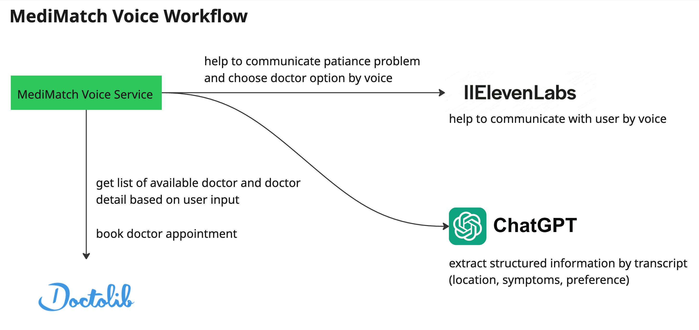

# 🏥 MediMatch Voice - Doctor Appointment Assistant

[](https://streamlit.io/)

A voice-enabled web application that helps users find and book doctor appointments using natural language. The application features a chat-like interface where users can describe their symptoms and preferences, and the system will find matching doctors in their area.

## ✨ Features

- **Voice Interaction**: Speak naturally to describe your symptoms and preferences
- **Smart Doctor Matching**: AI-powered search to find the most suitable doctors
- **Interactive Chat Interface**: Conversational UI for a natural user experience
- **Doctor Cards**: Visual representation of doctor information with details like:
  - Doctor's name and specialty
  - Location and contact information
  - Available appointment slots
  - Insurance acceptance
- **Chat History**: Review all suggested doctors in the conversation history
- **Responsive Design**: Works on both desktop and mobile devices

## 📊 Workflow



## 🚀 Getting Started

### Prerequisites

- Python 3.12+
- pip (Python package manager)
- OpenAI API key (for voice processing)
- ElevenLabs API key (for voice processing)

### Installation

1. Clone the repository:
   ```bash
   git clone https://github.com/yourusername/voice-doc-appointment.git
   cd voice-doct-appointment
   ```

2. Install Poetry if you haven't already:
   ```bash
   curl -sSL https://install.python-poetry.org | python3 -
   ```
   Or on Windows (PowerShell):
   ```powershell
   (Invoke-WebRequest -Uri https://install.python-poetry.org -UseBasicParsing).Content | python -
   ```

3. Install project dependencies using Poetry:
   ```bash
   poetry install
   ```

4. Activate the virtual environment:
   ```bash
   poetry shell
   ```

5. Create a `.env` file in the project root and add your API keys:
   ```env
   OPENAI_API_KEY=your_openai_api_key_here
   ELEVENLABS_VOICE_ID=your_elevenlabs_voice_id_here
   ELEVENLABS_API_KEY=your_elevenlabs_api_key_here
   ```

### Development

- To add new dependencies:
  ```bash
  poetry add package-name
  ```
  
- To run the application:
  ```bash
  poetry run streamlit run src/voice_doctor_appointment/app/main.py
  ```

## 🏃‍♂️ Running the Application

1. Start the Streamlit application:
   ```bash
   poetry run streamlit run src/voice_doctor_appointment/app/main.py
   ```

2. Open your web browser and navigate to `http://localhost:8501`

3. Click the "🎤 Start Voice Recording" button and speak your symptoms and location

## 🏗️ Project Structure

```
voice-doc-appointment/
├── src/
│   └── voice_doctor_appointment/
│       ├── app/
│       │   ├── models/           # Data models
│       │   ├── services/         # Business logic and services
│       │   ├── ui/               # User interface components
│       │   ├── config.py         # Application configuration
│       │   └── main.py           # Main application entry point
│       └── tests/                # Test files
├── .env.example                 # Example environment variables
├── .gitignore
└── README.md
```

## 🔧 Configuration

You can customize the application by modifying the following environment variables in your `.env` file:

- `OPENAI_API_KEY`: Your OpenAI API key for voice processing
- `ELEVENLABS_VOICE_ID`: Your ElevenLabs voice ID for voice processing
- `ELEVENLABS_API_KEY`: Your ElevenLabs API key for voice processing
- `DOCTOLIB_BASE_URL`: Base URL for doctor search API (default: https://www.doctolib.de)

## 🧪 Running Tests

To run the test suite:

```bash
pytest tests/
```

## 🤝 Contributing

Contributions are welcome! Please feel free to submit a Pull Request.

1. Fork the repository
2. Create your feature branch (`git checkout -b feature/AmazingFeature`)
3. Commit your changes (`git commit -m 'Add some AmazingFeature'`)
4. Push to the branch (`git push origin feature/AmazingFeature`)
5. Open a Pull Request

## 📄 License

This project is licensed under the MIT License - see the [LICENSE](LICENSE) file for details.

## 🙏 Acknowledgments

- Streamlit for the amazing web framework
- OpenAI for the voice processing capabilities
- All contributors who have helped improve this project
